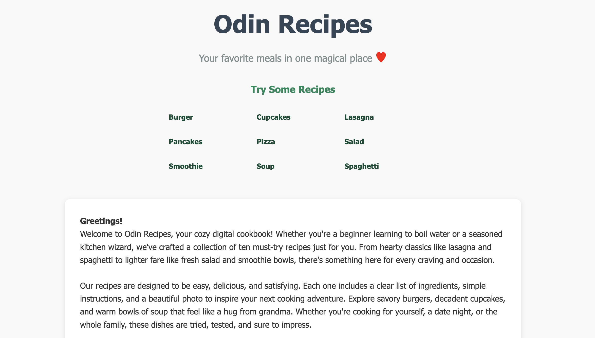
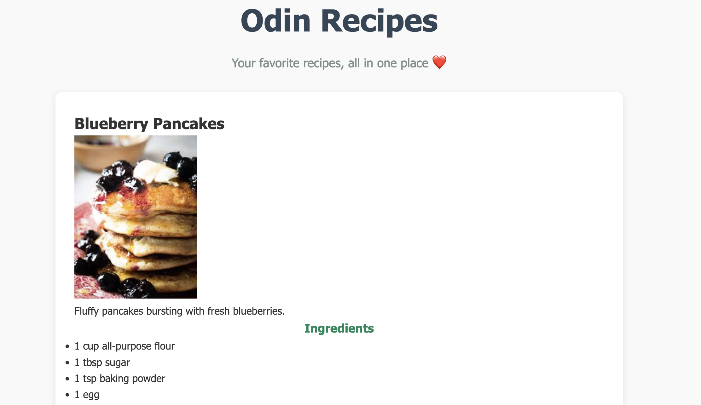

# 🥘 Odin Recipes

Welcome to my very first project from The Odin Project!  
A simple and fun collection of recipes built using **HTML** and **CSS**.

---

## 📜 Project Description

This project demonstrates basic web development skills including:

- Structuring pages with HTML5
- Styling with CSS3
- Linking multiple pages
- Basic responsive design

---

## 🚀 Live Demo

[Visit My First Website](https://anasanrai.github.io/odin-recipes/index.html)

---

## 🧑‍🍳 Featured Recipes

- Spaghetti
- Pancakes
- Cupcakes
- Lasagna
- Pizza
- Salad
- Smoothie
- Soup
- Burger

---

## 🛠️ Built With

- HTML5
- CSS3
- Visual Studio Code

---

## 📷 Screenshots

---

## 🙋‍♂️ Author

- **Anasan**
- [GitHub Profile](https://github.com/anasanrai)

---

## ⭐ Acknowledgments

- [The Odin Project](https://www.theodinproject.com/) — for guiding me through this journey!

---